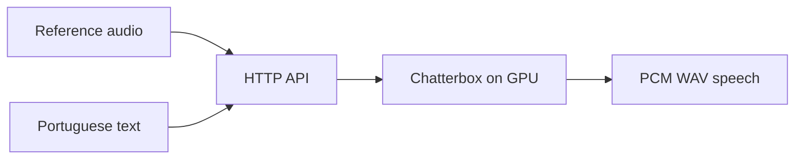

# Chatterbox PT-BR: self-hosted voice cloning API

Serve Brazilian Portuguese speech with the Chatterbox Multilingual V3 checkpoint through a small HTTP API. The server handles reference audio, chunked synthesis and model readiness; models and reference voices stay in separate persistent volumes.

[](https://github.com/bitdeep/chatterbox-ptbr-server/releases)
[](LICENSE)

**Start here:** [Run a voice clone](#run) · [HTTP API](#api) · [Validation](#validation) · [Work with me](#work-with-me)

## What this adds

- A FastAPI service for **text-to-speech and voice cloning in pt-BR**, with a curl example you can run locally.
- Readiness that distinguishes a listening process from a loaded model.
- Bounded reference uploads, separate data volumes and explicit model unload.
- A reusable Docker Compose service for applications that own authentication and customer data.

The anatomy of a cloning request, and what a clone costs today, is chapter 03 of the [garage-inference book](https://github.com/bitdeep/garage-inference/blob/main/03-voice-cloning/README.md).

This project supplies the server and deployment recipe. Chatterbox and its checkpoints are upstream work, credited in [THIRD_PARTY.md](THIRD_PARTY.md).



## Run

Requires Docker Compose, NVIDIA Container Toolkit and a CUDA GPU with enough free memory for the model and synthesis. Validate the peak on your hardware before sharing a GPU with another model.

```sh
docker compose build
docker compose up -d
curl --fail http://localhost:8004/api/model-info
```

First startup prepares the checkpoint in the `models` volume. Readiness is HTTP 503 until the model is loaded; the download and load may take several minutes.

Register a short voice reference you are entitled to use:

```sh
curl --fail -F 'files=@reference.wav' http://localhost:8004/upload_reference
curl --fail http://localhost:8004/tts \
  -H 'Content-Type: application/json' \
  -d '{"text":"Olá, este é um exemplo de síntese de voz.","voice_mode":"clone","reference_audio_filename":"reference.wav","language":"pt"}' \
  --output speech.wav
```

The API returns PCM WAV. `output_format` is accepted for compatibility but does not change the response format; the inference SDK converts it to MP3 when needed.

## API

| Route | Contract |
|---|---|
| `GET /api/model-info` | 200 only when loaded; 503 while loading or after unloading |
| `GET /get_reference_files` | Registered reference filenames |
| `POST /upload_reference` | Multipart `files`; WAV/MP3 references, at most 8 MiB per file |
| `POST /tts` | JSON request, cloned speech as WAV |
| `POST /api/unload` | Unload the model; restart the container to load again |

The recipe exposes only loopback. The server does not implement tenant authentication; run a dedicated instance and reference volume for each trust boundary, behind your own authenticated application. It never logs synthesis text or audio.

## Embed in a private deployment

Extend service `chatterbox` from `engine.compose.yaml`. Supply your image, model/reference volumes, resource limits and network in the private Compose. Build the image from this project, not from a copied server in the application repository.

The default recipe uses `restart: "no"` for explicit lifecycle ownership. A manager may start/stop the provisioned container for demand loading. Without a manager, use `docker compose up -d` and stop the service explicitly when finished.

## Validation

```sh
docker run --rm --network none --entrypoint python \
  -v "$PWD:/work" -w /work chatterbox-ptbr-server:0.1.0 \
  -m unittest discover -s tests
```

The CPU contract suite does not load a model. GPU validation must include real reference upload, synthesis, audio inspection and unloading; no benchmark is claimed merely from the unit suite.

The initial release was checked with five CPU contract tests and synthetic reference upload, GPU synthesis and decoded audio inspection. These are functional checks, not a speech-quality benchmark.

## Related projects

Use [the inference SDK](https://github.com/bitdeep/gpu-worker-orchestrator) to coordinate this server with [Whisper ASR](https://github.com/bitdeep/whisper-asr-stack) and [vLLM](https://github.com/bitdeep/vllm-serving-stack) on a shared GPU. Qwen3 and Kokoro adapters also live in the SDK.

## Work with me

I build self-hosted inference services and speech pipelines: model integration, GPU memory coordination, API contracts and deployment validation. For consulting or engineering opportunities, [contact bitdeep on X](https://x.com/_wrbr).

For reproducible bugs or feature requests, [open an issue](https://github.com/bitdeep/chatterbox-ptbr-server/issues). Include the version and a minimal synthetic example; keep credentials and personal voice recordings out of public issues.
